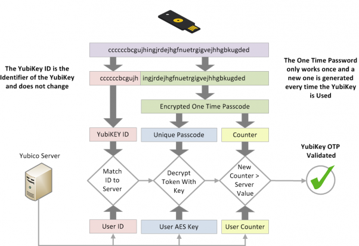

# Višefaktorska autentikacija
Višefaktorska autentikacija (MFA) se zasniva na tome da korisnik mora dokazati svoj identitet pomoću najmanje dva različita tipa faktora iz različitih kategorija.

1. **Nešto što znaš** (knowledge factors)
    * Lozinka ili PIN
    * Bezbednosna pitanja
    * Fraze ili kodovi poznati samo korisniku
2. **Nešto što imaš** (possession factors)
    * Mobilni telefon (SMS kod, poziv)
    * Hardverski token (npr. RSA SecurID, YubiKey)
    * Pametna kartica
    * Softverski token u aplikaciji (Google Authenticator, Microsoft Authenticator)
    * E-mail kod (manje bezbedno, ali se koristi)
3. **Nešto što jesi** (inherence factors)
    * Otisak prsta
    * Prepoznavanje lica
    * Skener zenice ili oka
    * Glasovna identifikacija
    * Prepoznavanje obrasca kucanja na tastaturi (keystroke dynamics)
4. **Negde gde jesi** (location factors)
    * Geolokacija (GPS koordinata)
    * IP adresa iz dozvoljenog raspona
    * Prijava samo sa određene mreže
5. **Nešto što radiš** (behavioral factors)
    * Način držanja telefona
    * Obrazac korišćenja aplikacije
    * Pokreti miša ili prstom po ekranu

## Višefaktorska autentikacija - possession factors
### Hardverski token
Hardverski token predstavlja fizički uređaj namenjen verifikaciji identiteta korisnika prilikom prijave na sistem. On se najčešće koristi kao drugi faktor u okviru višefaktorske autentikacije (MFA), zajedno sa lozinkom. Za razliku od softverskih tokena, hardverski tokeni funkcionišu nezavisno od pametnih telefona ili računara, čime se smanjuje rizik od infekcije malverom, fišing napada ili kompromitacije uređaja. Ovi bezbedni mehanizmi autentikacije doprinose zaštiti pristupa korisničkim nalozima.

Primeri hardverskih tokena uključuju:
* USB uređaje (npr. YubiKey)
* Ključeve za generisanje jednokratnih lozinki (OTP fob)
* Pametne kartice sa ugrađenim čipom
* Token uređaje sa NFC ili Bluetooth podrškom za bežičnu autentikaciju

#### YubiKey 
Yubico je kompanija koja proizvodi kriptografske uredjaje koji mogu raditi na više načina. Svaki od tih načina ima svoj princip generisanja i verifikacije koda.

#### YubiKey OTP generator
U memoriji uredjaja se nalazi **secret key** i **algoritam za generisanje OTP**

Yubico OTP je jedinstveni 44-karakterni ModHex string (OTP), koji se sastoji iz dve glavne komponente: prvih 12 karaktera koji čine **Public ID** (ne menja se—identifikuje uređaj) i preostalih 32 karaktera koji su **kriptografski generisan kod**

Kod se pravi tako što se u 128-bitnu strukturu kombinuju sledeći podaci: privatni ID, brojač upotrebe, vremenski pečat, sesijski brojač, slučajni broj i kontrolni zbir. Ta struktura se zatim AES-128 enkriptuje i enkodira u ModHex formatu

