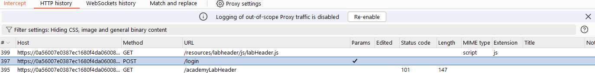
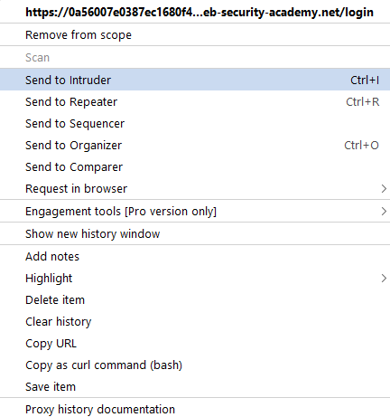
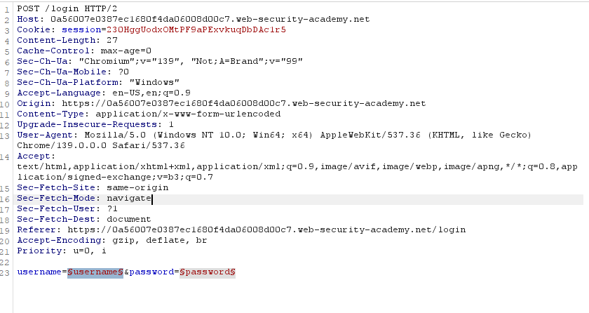
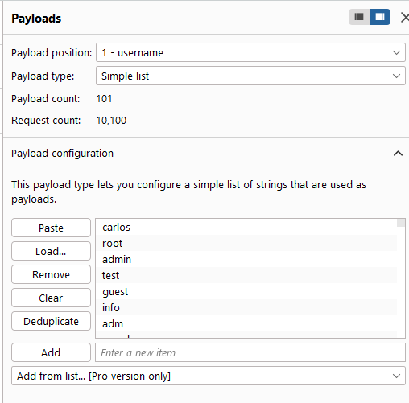
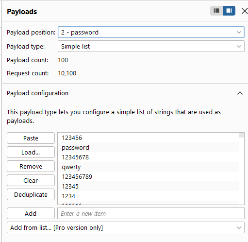

# Lab: Username enumeration via different responses

potrebno je ulogovati se na sajt
data je lista username i lista password
potrebno je pronaci par username password koji ce nas ulogovati na sajt

koristeci alat burp suite tj njegovu funkciju intruder
mozemo podesiti da iskoristimo listu username i password i da pravi kombinacije i salje kao payload

prvo moramo da dobavimo login request, to cemo uraditi tako sto cemu otici na stranicu poslati jedan log in zahtev, naci taj zahtev u  proxy > HTTP history i poslati ga u intruder

za vrstu brute force napada koristimo cluster bomb attack

u log in requestovu vidimo payload parametre:

mozemo da ih parametrizujemo na sa $$ znakovima i podesimo im liste po na osob

korisničko ime: 

lozinka:

zatim na kraju poredili duzinu odgovora svi su bili 3348 ili 3350
tj odgovor koji je bio 3348 je imao pogresan korisničko ime a odgovor 3350 je imao odgovor pogresan lozinka, sto je znacilo da odgovor sa 3350 duzinu je imao tacan korisničko ime to jest "alterwind"
zatim je pokrenut novi intruder napad gde je koriscena lista lozinka i jedan korisničko ime "alterwind", dobijena lozinka je bila jessica, i odgovor sa korisničko ime "alterwind" i lozinka "jessica" je bio duzine 191 koji je bio uspesno logovanje

potragna za tačnom lozinkom sa vec pornadjenim tačnim korisničko ime alterwind: 

