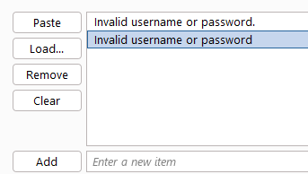

# Lab: Username enumeration via subtly different responses

početak zadatka skroz isti prethodnom,
ručno poslati log in zahtev na stranici, uhvatiti ga pomoću intercept, poslati ga u intruder, postaviti username i password i čekati do se ne desi nešto neubičajno,

ovaj nije toliko očigledan jer je dužina odgovora relativno slična, ne dobijamo odgovor da li je tačno korisničko ime ili ne već da je ili korisničko ime ili lozinka pogrešna i takodje se duzina stalno menaj jer se salje id različitih dužina

ali iz rešenja jer mi ovo nikad ne bi palo na pamet poruka "Invalid username or password" ima grešku, kada je korisničko ime tačno nema "." a kada je korisničko ime ne tačno ima

po tome možemo filtrirati odgovore pomoću Grep match

i naći odgovore koji u sebi imaju Invalid username or password bez "." 
korisničko ime u zahtevu od tog odgovora se nalazi naše traženo korisničko ime "adserver"

sada kada imamo korisničko ime ćemo da ponovo iz prvog zadatka pokrenut intruder samo sa tim korisničkim imenom i listom lozinki dok ne nadjemo pravu lozinku