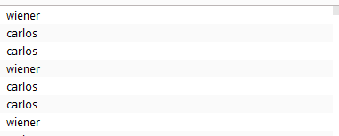
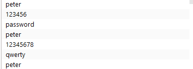
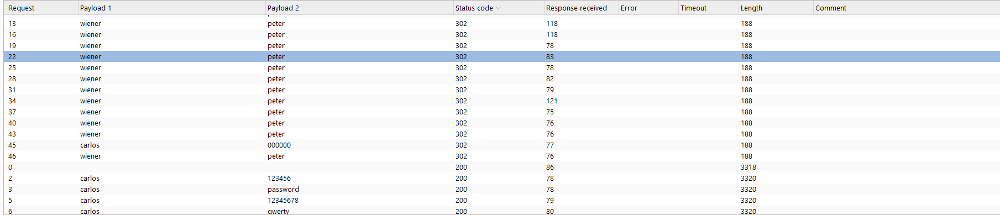

# Lab: Broken brute-force protection, IP block

U ovom zadatku se eksploatise losa logika za odbranu protiv bure force
namesten je counter za ne uspesno logovanje, koji blokira dalje logovanje
problem u logici je sto nakon uspesnog logovanja counter se resetuje.
To mozemo da iskoristimo tako da nakon svaka dva ne uspesna logovanja posaljemo jedan request sa uspenim logovanjem vec poznatim nalogom

da bi to postigli napravili smo listu korisničkih imena u kojoj se nalazi poznato korisničko ime a onda dva puta korisničko ime od kog želimo da saznamo šifru

u listi lozinki se postavi poznata lozinka pa dva pokušaja nepoznate lozinke 

pitchfork napad u parovima šalje zahteve i tako isprobava svaku lozinku za carlosa 

u grupi upsešnih zahteva možemo naći carlosa

