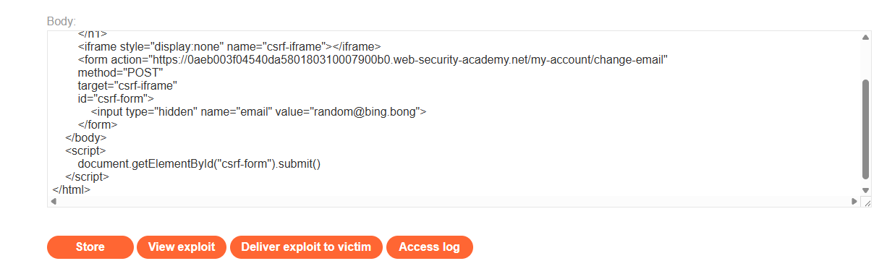

Lab: CSRF vulnerability with no defenses

u ovom zadatku zelimo da promenimo mail nase zrtve na neki mail koji mi koristimo

za ovaj zadatak nam je bitno da znamo koje parametre request prima

posto request za menjanje mail prima samo email mozemo da napravimo nas sajt
koji ima skrivenu formu koja će čim korinsik udje na naš sajt poslati zahtev da se njegov email izmeni

ovo će raditi samo ako je korisnik već ulogovan na sajt na kom želimo da menjamo mail

portSwigger explot server za validaciju exploita:

