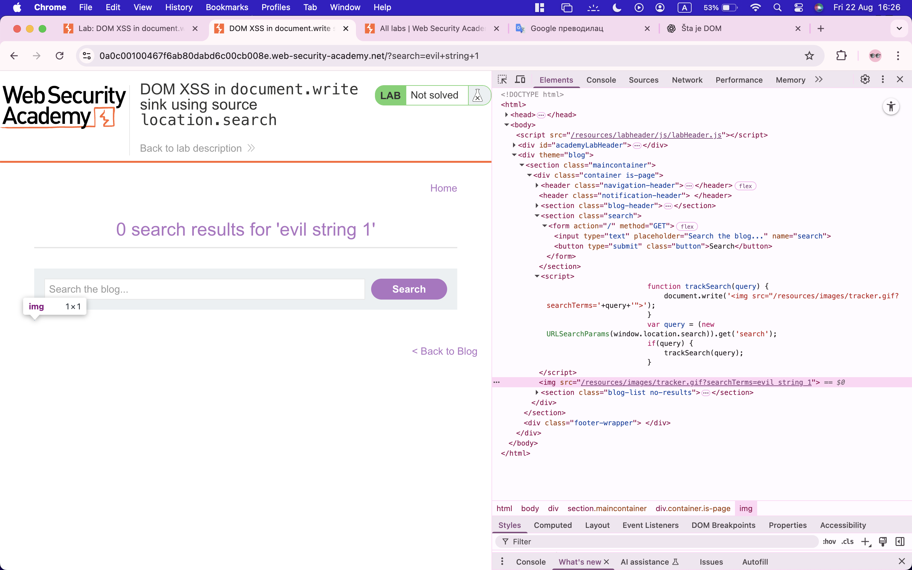

DOM (Document Object Model) je programski interfejs (API) koji predstavlja HTML ili XML dokument kao hijerarhijsku strukturu čvorova (nodes). Svaki element u HTML-u (kao što su `
`, `
`, `<a>`, itd.), atributi i tekst u njima predstavljeni su kao objekti (čvorovi) u stablu.

Osnovne karakteristike:

* Hijerarhijska struktura – DOM dokument je organizovan kao stablo gde je koren `<html>`, a grane su elementi.

* Omogućava manipulaciju sadržajem – Pomoću programskih jezika (najčešće JavaScript) možemo:

    * Dodavati/brisati elemente

    * Menjati atribute `(src, class, id, ...)`

    * Menjati tekstualni sadržaj

    * Reagovati na događaje (klik, scroll, input...)

* Standardizovan od strane W3C – Postoji definisan API koji browseri implementiraju.

## Uticaj DOM-based vulnerabilites na sistem
Taint-flow vulnerabilities (ili taint analysis vulnerabilnosti) odnose se na bezbednosne propuste koji nastaju kada se nepouzdani podaci (uneti od strane korisnika ili iz spoljnog izvora) propagiraju kroz aplikaciju do osetljivih operacija bez adekvatnog pročišćavanja (sanitizacije).

* Tainted data (zaraženi podaci) – svaki podatak koji dolazi od korisnika, HTTP request-a, URL parametara, kolačića, baze (ako je nevalidirana), itd.

* Taint source – mesto gde se unose nepouzdani podaci (npr. $_GET, req.body, forma, API input).

* Taint sink – kritična tačka u kodu gde se ti podaci koriste za izvršavanje opasnih operacija (npr. SQL upit, eval funkcija, komandna linija, HTML rendering).

* Propagacija – kada aplikacija prenosi taj podatak iz funkcije u funkciju bez validacije/sanitizacije.

## Kako se boriti protiv ovakvih napada
Potpuno eliminisanje DOM-based napada nije moguće jednom jedinom merom, ali postoje preporuke koje značajno smanjuju rizik:

* Izbegavajte direktnu upotrebu nepouzdanih podataka
Najefikasniji način zaštite je da se ne dozvoli da podaci iz nepouzdanog izvora dinamički menjaju vrednost koja se prosleđuje ka "sink"-u (npr. innerHTML, eval, document.write, URL parametri).

* Ako je takvo ponašanje neizbežno, implementirajte zaštitu na klijentskoj strani

    * Validacija na osnovu bele liste (whitelist) – dozvolite samo sadržaj koji je siguran i očekivan.

    * Sanitizacija ili enkodiranje podataka – u zavisnosti od konteksta u kojem se podaci ubacuju:

        * JavaScript escaping

        * HTML encoding

        * URL encoding

    * Ove tehnike se često kombinuju kako bi se obezbedila potpuna zaštita.

* Kontekstualna zaštita
Vrlo je važno da se enkodiranje primeni u skladu sa mestom ubacivanja podataka (npr. HTML atribut, JavaScript kod, URL).

## DOM-based XSS
DOM-based XSS ranjivosti nastaju kada JavaScript kod preuzima podatke iz izvora koji može biti pod kontrolom napadača (npr. URL) i prosleđuje ih ka sink-u koji omogućava dinamičko izvršavanje koda (npr. eval(), innerHTML). Ovo omogućava napadaču da izvrši maliciozni JavaScript kod, što najčešće dovodi do kompromitovanja korisničkih naloga.

### Kako funkcioniše DOM-based XSS napad?

Potrebno je ubaciti podatke u izvor (source), tako da se oni propagiraju do sink-a i izazovu izvršavanje proizvoljnog JavaScript-a.

Najčešći izvor za DOM XSS je URL, kojem se pristupa preko window.location objekta.

Napadač može konstruisati link koji vodi žrtvu na ranjivu stranicu, pri čemu se payload ubacuje u:

* Query string (npr. ?param=<payload>)

* Fragment deo URL-a (npr. #<payload>)

* U određenim situacijama, poput 404 stranica ili PHP aplikacija, payload se može ubaciti i u path.

### Taint Flow

Za detaljnije objašnjenje toka podataka između izvora (sources) i odredišta (sinks), potrebno je konsultovati stranicu o DOM-based vulnerabilnostima (OWASP).

## Zadaci
### Lab: DOM XSS in `document.write` sink using source `location.search`
1. U search-bar unosimo bilo koji string - U inspect elements primećujemo da je u `img src` postavljen pretraženi string 
2. U search-bar-u unosimo `"><svg onload=alert(1)>` Komandu da bismo aktivirali alert i ispisali broj 1 

### Lab: DOM XSS in `innerHTML` sink using source `location.search`
1. U search-bar unosimo bilo koji string - U inspect element pronalazimo skriptu koja radi sa `innerHTML` elementom 
2. Unosimo `` da bismo ispisali alert 

### Lab: DOM XSS in `document.write` sink using source `location.search` inside a select element
1. Kada udjemo u `View details` primećujemo da postoji select element. On u sebi sadrzi polje `storedId` prema kom useru pokazuje opcije koje mogu da se selektuju. 
2. U url adresi mozemo da dodama storedId kao parametar. Vrednost parametra biće prikazana u select elementu 
3. U taj parametar možemo ubaciti maliciozan kod `"></select>` 

### Lab: DOM XSS in AngularJS expression with angle brackets and double quotes HTML-encoded
1. U search-bar unosimo bilo koji string da vidimo kako se on ponaša - Angular ga preko submit search button-a integrise u pretragu 
2. Unosimo kod u duplim uglastim zagradama `{{$on.constructor('alert(1)')()}}` 

### Lab: Reflected DOM XSS
1. U search-bar unosimo bilo koji string. Iz proxy tool-a možmo da vidimo da se formira json fajl sa rezultatima pretrage
2. U Target/Site map mozemo da otvorimo search results i shvatimo da se poziva eval() funkcija  
3. Unosenjem `\"-alert(1)}//` u search bar dobijamo zeljeni rezultat 