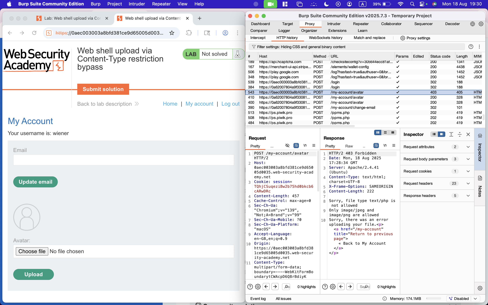

# File upload vulnerabilities

Ova vrsta napada dešava se kada programer nema validaciju za upload fajla. Kod validacije fajlova bitno je proveriti:
    * Ime fajla - da li sadrži odgovarajuću ekstenziju
    * Tip fajla (MIME type) - da li je zaista traženi fajl (npr slika)
    * Sadržaj fajla - da li odgovara deklarisanom tipu
    * Veličinu fajla 
    * Lokaciju čuvanja fajla - da li korisnik ima kontrolu nad time
Nepostojanje validacije ili nepravilna/nedovoljno jaka validacija može da dozvoli korisniku da ubacijue maliciozne fajlove poput skripti ili binarnih fajloval u aplikaciju. 

## Uticaj file upload ranjivosti na sistem
Uticaj ove ranjivosti zavisi od dva slučaja neuspešne validacije:
    1. Koji aspekt fajla web alplikacija ne uspeva da validira (veličina, tip ..)
    2. Koja su ograničenja primenjena na datoteku nakon što se uspešno otpremila

### RCE - Remote Code Execute + Web Shell
Ako server ne proverava tip fajla i dozvoljava izvršavanja .php .asp .jsp ... onda napadač može otpremiti skriptu (Web Shell) koja omogućava daljinsko komandovanje serverom. Time dobija potpunu kontrolu nad serverom što je najgori scenario jer je ceo sistem kompromitovan.

### Overwritting kritičnih fajlova
Ako se ne proverava ime fajla napadač može otpremiti fajl sa imenom koje već postoji (index.html) i time potencijalno prebrisati važne fajlove za aplikaciju poput konfiguracija. 

Ako je kombinovano sa directory traversal ranjivošću fajl se može ubaciti u potpuno drugu lokaciju. Time se postiže oštećenje postojećih fajlova, njihovo brisanje i njihova zamena.

### Denial of Service 
Ako se ne ograniči veličina fajla napadač može otpremiti prevelike fajlove i time izazvati pad sistema i nemogućnost rada aplikacije. 

### XSS - Cross-Site Scripting
Ako server dozvoljava otpremanje fajlova koji se renderuju u browser-u (.html .svg) napadač može ubaciti maliciozni .js kod. Kad drugi korisnici otvore taj fajl izvršava se XSS napad. 

## Zadaci 
### Lab: Remote code execution via web shell upload
1. Preuzeti burp sa sajta.
2. Otvoriti Chromium iz burp-a. Ulogovati se na nalog i pronaći zadatak.
3. Iz Proxy > HTTP history na Burp-u pratiti zahteve koji se šalju.
4. Definisati php web shell [Prikaži file.php](./file.php)
5. Ulogovati se na lab vežbu sa datim kredencijalima (wiener:peter)
6. Uploadovati web shell umesto svoje profilne slike 
7. Vratiti se na svoj nalog nakon uspešnog otpremanja slike
8. Pročitati response iz tajnog fajla 

### Lab: Web shell upload via Content-Type restriction bypass
1. Iz prethodne vezbe ponoviti sve od koraka 2 do koraka 6 (koristiti isti web shell)
2. Pronaći post request koji nije uzpeo i poslati ga u repeater  
3. Izmeniti Content-Type post-a i ponovo poslati taj zahtev   
4. Uveriti se da je zahtev uspesno poslat 
5. Procitati secret iz get zahteva 

### Lab: Web shell upload via path traversal
1. Iz prethodne vezbe ponoviti korak 1. i 2. (koristiti isti web shell) 
2. U get zahtevu se ne dobija secret vec se samo izpisuje sadrzaj  Pronaci post zahtev i izmeniti filename u content-type-u  Vidimo da je u respons-u od posta odsecen string `../`
3. Pokusati da se karakter `/` zameni sa `%2f` 
Sada iz respons-a vidimo da je web shell uspesno sacuvan u fajlu iznad 
4. Procitacemo secret iz get zahteva 

### Lab: Web shell upload via extension blacklist bypass
1. Ponoviti iz prethodne vezbe koraj 1.
2. Odpremiti [.htaccess fajl](./.htaccess) 
3. Izmeniti u post zahtevu da prilikom odpremanja `.htacces` fajla content-type bude text/plain 
4. Nakon toga uploadovati file.php ali u post izmeniti da je ekstenzija ona iz `.htaccess` fajla (.evil) 
5. Prozitati iz get zahteva Karlosovu malu tajnu 

### Lab: Web shell upload via obfuscated file extension
1. Ponoviti iz prethodne vezbe korak 1.
2. Odpremiti [file.php falj](./file.php) 
3. Izmeniti post zahtev da filename u `Content-Disposition` bude drugačiji   
4. Pricitati tajnu iz get zahteva 